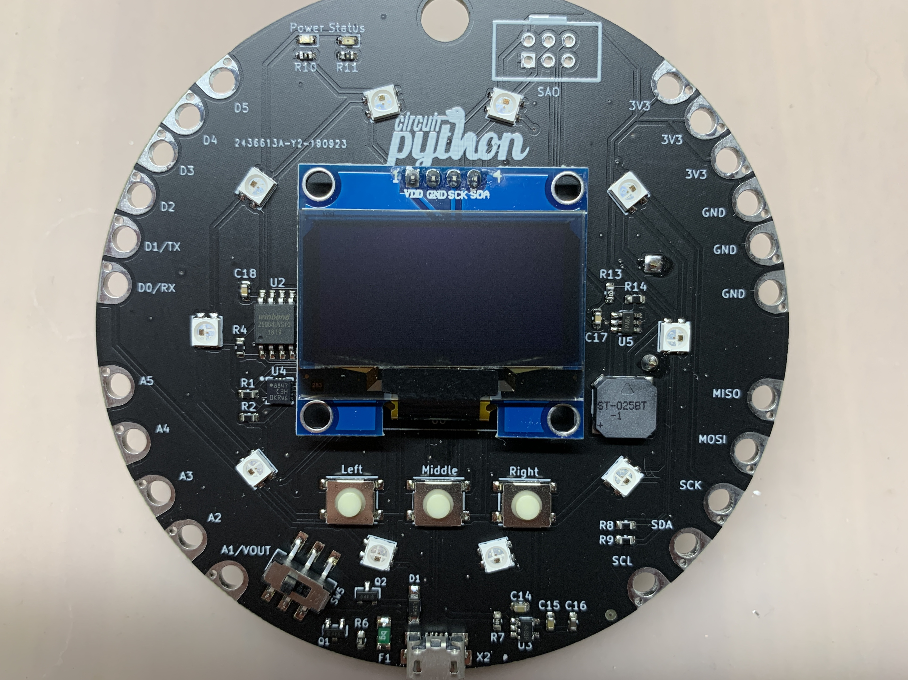

# CircuitPythonBadge
Open Source Hardware Circuit Python Badge

https://kevinneubauer.com/portfolio/circuitpython-badge/

Known Issue(s):
V1.2:
- The VDD pin on the PAM8301 chip is missing a 1 uF and a 10 uF decoupling capacitor. Without these, the speaker audio will randomly drop out. Fixed in v1.3.